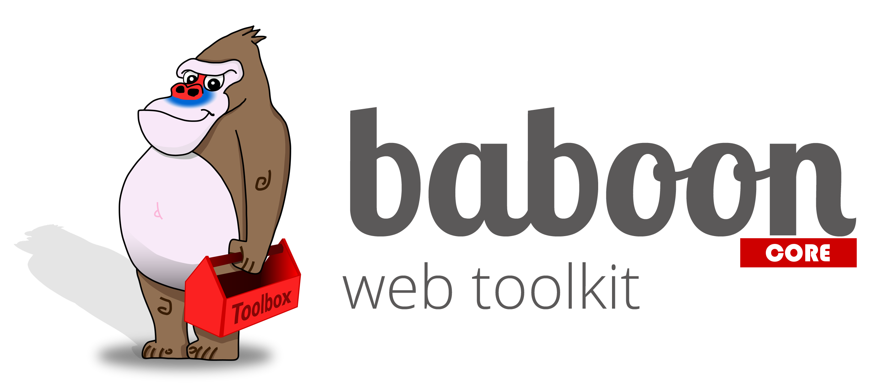

# baboon
> Baboon Web Toolkit, modular fullstack web application framework for single-page realtime apps.

> 

Baboon is an open source web toolkit for creating Single Page Real-time applications.
It combines tools, libraries, own developments as well as existing frameworks into a complete,
ready for immediate use toolkit. It covers all activities necessary for the development process for the creation
of a single page real-time applications.

Baboon takes care of the complete setup of an immediately usable architecture for SPAs and also provides
the basic functionality of the application. In addition to simple things like LESS-based design,
it also includes the complete implementation of a websocket transport for the real-time communication inside the application. Last but not least the availability of many modules makes Baboon a full SPA-framework. All that is left to you is taking care of your business logic - the rest is done by Baboon.

* Baboon project generator https://github.com/litixsoft/generator-baboon

# Install
The installation of a Baboon project is very simple. However, some preparatory work is needed.

## System requirements

Baboon need only NodeJS on the respective system.
In production mode on server with activated rights system following stack is desirable:

* MongoDb 3.X.X or newer
* NodeJs 6.X.X

Such a stack including NodeJS version management, RedisIO, MongoDb and other tools can be found here: the [baboon-stack](https://github.com/litixsoft/baboon-stack) covers an easy-to-use one-click setup for Windows, Linux and Mac.
The baboon-stack is suitable with the NodeJS version management also ideal for development.

## NodeJS global dependencies
Without using baboon-stack, you need install Baboon's global dependencies. Skip this section when using Baboon-stack.

Linux / Mac:

    $ sudo npm install -g karma bower grunt-cli yo generator-baboon

Windows:

    $ npm install -g karma bower grunt-cli yo generator-baboon

## Create and start your baboon project
You can simply create a Baboon project with a yeoman generator-baboon and start with grunt serve.
The application starts in development mode with live reload functionality that monitors the directories for any changes.
If changes are detected, a new build is created, the server is restarted if necessary, and the browser is updated.

    $ mkdir my-new-project && cd $_
    $ yo baboon [app-name]
    $ grunt serve

Look out for more information in the sample application or check out the documentations on our web site.

# Contributing
Instead of us handing out a formal style guide, simply stick to the existing programming style. Please create descriptive commit messages.
We use a git hook to validate the commit messages against these [rules](https://docs.google.com/document/d/1QrDFcIiPjSLDn3EL15IJygNPiHORgU1_OOAqWjiDU5Y/edit#heading=h.uyo6cb12dt6w).
Easily expand Baboon with your own extensions or changes in the functionality of Baboon itself. Use this workflow:

1. Write your functionality
2. Write unit tests for your functionality
3. Create an example of your functionality in the sample application (optional)
4. Document your functionality in the documentation section of example app
5. Write unit tests for the example
6. Add end to end tests for the example
7. All tests should be successful
8. Check your test coverage (90 - 100%)
9. Make a pull request

We will check the tests, the example and test coverage. In case your changes are useful and well tested, we will merge your requests.

# Building and Testing Baboon
This section describes how to set up your development environment to build and test Baboon with the example app.

# Author
[Litixsoft GmbH](http://www.litixsoft.de)

# License
Copyright (C) 2013-2017 Litixsoft GmbH <info@litixsoft.de>
Licensed under the MIT license.

Permission is hereby granted, free of charge, to any person obtaining a copy
of this software and associated documentation files (the "Software"), to deal
in the Software without restriction, including without limitation the rights
to use, copy, modify, merge, publish, distribute, sublicense, and/or sell
copies of the Software, and to permit persons to whom the Software is
furnished to do so, subject to the following conditions:

The above copyright notice and this permission notice shall be included in
all copies or substantial portions of the Software.

THE SOFTWARE IS PROVIDED "AS IS", WITHOUT WARRANTY OF ANY KIND, EXPRESS OR
IMPLIED, INCLUDING BUT NOT LIMITED TO THE WARRANTIES OF MERCHANTABILITY,
FITNESS FOR A PARTICULAR PURPOSE AND NONINFRINGEMENT. IN NO EVENT SHALL THE
AUTHORS OR COPYRIGHT HOLDERS BE LIABLE FOR ANY CLAIM, DAMAGES OR OTHER
LIABILITY, WHETHER IN AN ACTION OF CONTRACT, TORT OR OTHERWISE, ARISING FROM,
OUT OF OR IN CONNECTION WITH THE SOFTWARE OR THE USE OR OTHER DEALINGS IN
THE SOFTWARE. DEALINGS IN THE SOFTWARE.
